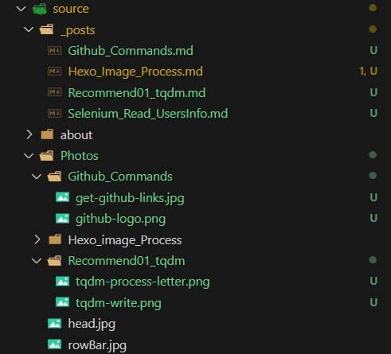
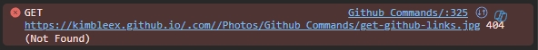
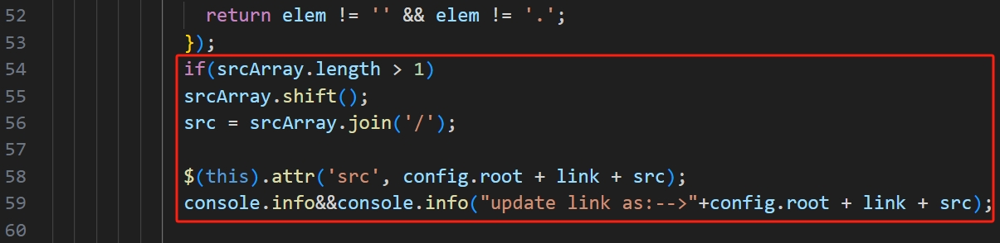
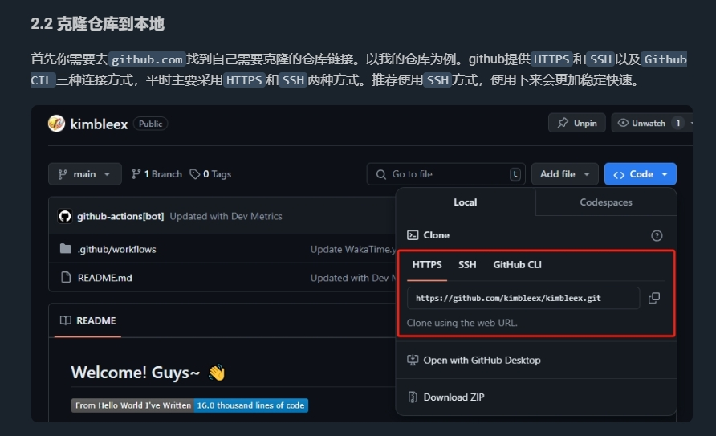

使用Hexo搭建个人博客时，插图片总是无法被读取。在网上查找了很多资料，都是让你安装`hexo-asset-image`插件，并且将根目录下的配置文件中的`post_asset_folder`设置为`true`。然而，我的亲身实践经历证实了这并不管用。

我在一篇博客中引用了我`source/Photos/`目录下的图片。并且经过检查我的相对路径是完全正确的，但是在博客页面中出现了报错。

目录结构为：



网页端报错为：



可以看到，我的本地目录经过指令`hexo deploy -d`构建后，网页读取的图片地址是`https://kimbleex.github.io/.com//Photos/Github_Commands/get-github-links.jpg`，相比于正确的应该被读取的地址`/Photos/Github_Commands/get-github-links.jpg`，多出了两个前缀，还多出了一个`/`，这显然是地址转化的过程中的问题。

OK事情又回到了本源，我在插入图片时，为了让hexo自动转化图片的地址，下载了`hexo-asset-image`插件，现在地址出现了问题，这显然是它的锅。

于是，我打开了这个插件的代码，仔细琢磨了它的代码逻辑，果然发现了罪魁祸首。



在`node_modules/hexo-asset-image/index.js`中，它给图片路径长度大于1的路径增加了一个`/`，并且在转换路径的过程中加入了`root`和`link`前缀，这不就是我们网页端报错的问题所在吗？

于是，按照正确的地址路径，修改`node_modules/hexo-asset-image/index.js`中的路径转换逻辑。

修改后的代码片段如下：

```Javascript
//将原来的逻辑代码注释掉，如下所示，并将最后的代码转换逻辑修改为正确的图片路径 

// if(srcArray.length > 1)
// srcArray.shift();
// src = srcArray.join('/');
// $(this).attr('src', config.root + link + src);
// console.info&&console.info("update link as:-->"+config.root + link + src);            
$(this).attr('src',  src);
console.info&&console.info("update link as:-->"+ src);
```

修改后，重新部署，图片可以正常显示。


