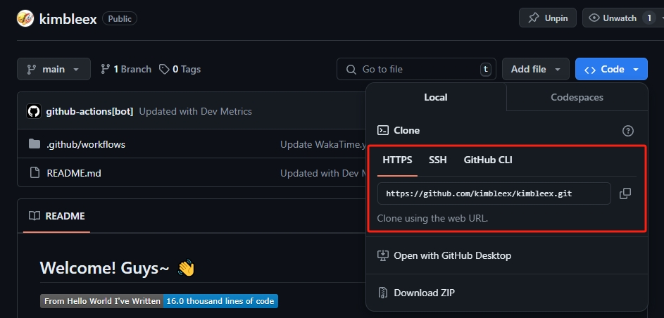

时维七月，序属二夏。

最近要系统的用到github，大学里看它的时候也是走马观花，现如今书到用时方恨少。于是，在一个[老前端](https://github.com/miaobuao)两天的帮助下，我对github的了解也是得到了一些提升。现在系统的将github用法做一个汇总，以方便后续的学习。

**此篇博客默认已经安装好`Git`工具并配置好系统环境**

### 1. 最先的配置操作

安装好`git`后，首先需要配置`git`的用户名和邮箱，这样在提交代码时，就可以显示出提交者的信息。

```Bash
git config --global user.name "Your Name"
git config --global user.email "Your Email"
```

我在公司使用的电脑是有配置`proxy`的，访问`Github`会比较缓慢，可以取消代理配置。没有代理可以忽略。

```Bash
git config --global --unset http.proxy
```

### 2. 一次完整的克隆和上传

#### 2.1 首先进入到工作目录，在工作目录中初始化git

```Bash
git init
```

#### 2.2 克隆仓库到本地

首先你需要去`github.com`找到自己需要克隆的仓库链接。以我的仓库为例。github提供`HTTPS`和`SSH`以及`Github CIL`三种连接方式，平时主要采用`HTTPS`和`SSH`两种方式。推荐使用`SSH`方式，使用下来会更加稳定快速。



链接复制完成后，打开`Windows PowerShell`或者`Git Bash`，进入到本地工作目录中，输入以下指令。

```Bash
git clone git@github.com:kimbleex/kimbleex.git
```

#### 2.3 为本地仓库添加远程仓库

需要给本地仓库添加一个远程github目标仓库链接，以将本地仓库内容提交到目标仓库中。

```Bash
# 添加一个名为repositoryName的远程仓库
git remote add repositoryName repositoryLink
```

#### 2.4 上传本地代码到github仓库

要提交到github仓库，首先要了解它的工作原理。

git为了保证代码的原子性(即可以很容易的回滚到任何阶段的代码状态)，发明了一个叫做暂存区的概念。我们在提交代码之前可以将所有的修改都保存到暂存区中，这样我们可以通过一些指令精细的挑选出我们需要提交的修改。

```Bash
# 将名为FileName的文件上传到暂存区中
git add FileName 
# 将目录下所有文件上传到暂存区中
git add .

# 将暂存区中的修改提交到github仓库
# -m表示msg，后面的信息为提交的备注信息，可以为空
git commit -m "Your Commit Message"
# 如果有反复修改，可以合并提交
git commit --amend -m "Your Commit Message"
```

这样，我们就完成了一次完整的克隆和上传。

在`commit`之后，我们就可以同步更新github仓库了。

```bash
# 默认更新github仓库的master分支
git push repositoryName master
```

执行完成后，进入`github.com`，刷新一下仓库页面，即可看到仓库的代码更新和`commit`时输入的`msg`。

### 3. 仓库的同步

我们可能不止在一个本地段操作同一个github仓库。比如我在公司更新我保存个人博客源码的github仓库，我回家后也需要操作，但是我家里本地的仓库就是滞后的，并不是最新的，这样我们就需要更新我家里电脑的本地仓库。

```Bash
# 拉去远端github仓库
git fetch 

# 用远端github仓库覆盖更新本地仓库(2.3小节中使用remote绑定的名为repositoryName的远程仓库)
git merge repositoryName/master 
```

我们可以使用以下指令合并上述的两个操作。

```Bash
git pull repositoryName master
```

恭喜你，你已经学会了最基本的`git`指令。

### 4. 踩坑实记

正当我沾沾自喜的以为自己已经如入无人之境的时候，我的仓库某个目录下的文件push失败了，我又去找了老前端，原因是该目录下我clone了别人的仓库，但是没有将别人仓库下的`.git`文件删除，并且在后续删除.git之前我就已经`git add`过了，导致最后`commit`的时候显示nothing changed，他直接甩给我一行指令。

```Bash
# directory为目录名
git submodule deinit directory
```

查阅后发现时说是取消注册，但是实践下来并没有啥作用，后续尝试过使用`git rm`指令，**千万不要使用，使用后会将本地仓库的目录和远端github仓库的目录全部删除**，血淋淋的踩坑。

### 5. 其他指令(并不常用，仅做些许列举)

```Bash
# 展示提交日志
git log
# 显示已存在的分支tag
git tag
# 展示未add到暂存区的修改
git diff
# 比较远端github仓库已有的修改但是本地没有的
git diff repositoryName/master..master
# 展示提交历史对应的修改
git whatchanged
# 搜索文件中的文本内容
git grep "Search Content"
```
