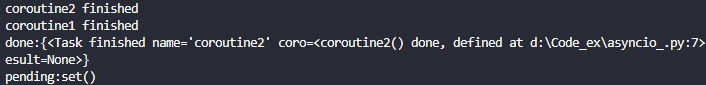
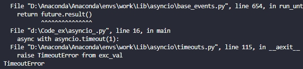

## 1. `Asyncio`异步处理基本概念

>`async`  ：写在函数开头，将指定函数转换为协程。
>
>`event_loop` ：事件循环，将协程注册到事件循环上协程才可以被调用。
>
>`coroutine` ：协程，类似于平常所说的函数，用于实现某些操作，**只有被转为任务或者注册到事件循环上后才可以执行，否则返回一个协程对象。**
>
>`await` ：写在协程、任务前，用于挂起阻塞的异步调用 。
>
>`task` ：任务，进一步封装好的协程，可以直接被调用。
>
>`future` : 从功能来讲是跟task差不多，但是它是一个底层的等待对象，表示一个异步操作的最终结果，通常情况下不会在应用层级创建。

## 2. `Asyncio`异步处理基础上手

### 2.1 协程和休眠

根据第1小节有关协程的介绍，简单写一个协程，使用`async`关键字定义一个协程函数。再使用`await`关键字挂起一个阻塞。

```python
import asyncio
import time
# 定义一个协程函数，其中使用await关键字进行休眠
# asyncio.sleep(seconds)函数表示休眠时间，参数为秒
async def startDreamPlace():
    print(f"started at {time.strftime('%X')}")
    print('Hello World!')
    await asyncio.sleep(2)
    print('World Hello!')
    print(f"ended at {time.strftime('%X')}")
# asyncio.run()函数表示调用协程，参数为协程函数
asyncio.run(startDreamPlace())
```

运行结果如下：


可以看到执行代码共计2s，与预期一致。

**注意：协程不能直接调用！**如果直接调用协程返回的只有一个协程对象，并抛出`RuntimeWarning`报错，无法执行内部逻辑。将上述案例进行修改如下。

```python
import asyncio
import time

async def startDreamPlace():
    print(f"started at {time.strftime('%X')}")
    print('Hello World!')
    await asyncio.sleep(2)
    print('World Hello!')
    print(f"ended at {time.strftime('%X')}")

startDreamPlace()
```

运行结果为：


### 2.2 任务

引入**任务**这一概念来实现多个协程的并发运行。当我两个任务都需要一定的运行时间时，可以通过并发操作来调整不同任务对cpu的时间占用，使得整个流程更加高效。

`task`对象的常用方法如下：

>**`asyncio.create_task(coro,*,name,context,eager_start)`**  创建化`task`对象，其中`coro`为协程对象，`name`为任务的名称可自命名，默认为`None`，`context`为关联到该任务的`contextvars.Context`对象，默认为`None`，`eager_satrt`为是否主动默认为`False`。
>
>**`task.cancel()`**  取消任务对象，会抛出`asyncio.CancelledError`异常，可被捕获
>
>**`task.done()`**  如果任务已执行完成，返回True
>
>**`task.result()`**  返回任务的返回值
>
>**`task.exception()`**  返回任务所抛出的异常
>
>**`task.get_coro()`**  返回任务所包装的协程对象，如果任务主动完成，返回None，见`3.1 主动任务工厂`
>
>**`task.get_name() & task.set_name`**  获取任务名称 & 设置任务名称

写一个案例。

```python
import asyncio
import time
# 定义两个协程
async def coroutine1():
    await asyncio.sleep(5)
    print('coroutine1 finished')
async def coroutine2():
    await asyncio.sleep(3)
    print('coroutine2 finished')
async def main():
    task1 =  asyncio.create_task(coroutine1())
    task2 = asyncio.create_task(coroutine2())
    print(f"started at {time.strftime('%X')}")
    await task1
    await task2
    print(f"ended at {time.strftime('%X')}")
asyncio.run(main())
```

运行结果如下：


可以看到整体时间为5s而不是8s，这就实现了基本的异步功能。如果没有使用异步，直接逐步调用协程或者普通函数，上述代码的运行时长为8s。

### 2.3 任务组`TaskGroup()`

在python 3.11版本中新增了**任务组`asyncio.TaskGroup()`**，它可以将很多`tasks`加入到其中，并挨个等待执行。如果任务组中任何一个任务因为非人为取消的异常而失败，任务组中后续的所有任务都将会被终止。

任务组是一个异步上下文管理器，以`async with`开头。

```python
import asyncio
# 定义两个携程
async def coroutine1():
    print('coroutine1 finished')
    return True
async def coroutine2():
    print('coroutine2 finished')
    return True
# 使用任务组
async def main():
    async with asyncio.TaskGroup() as tg:
        task1 = tg.create_task(coroutine1())
        task2 = tg.create_task(coroutine2())
    print(f'task1-result:{task1.result()},task2-result:{task2.result()}')
```

运行结果如下：


可以看到任务组中的任务都成功执行了。

#### 2.3.2 `asyncio.gather()`

其中，`async.TaskGroup().create_task()`等价于`asyncio.create_task()`，`.result()`函数可以获取任务的返回值参数。

#### 2.3.1 `asyncio.gather()`

与任务组进行对比的是**`asyncio.gather()`**函数，它的参数表达式如下：

```python
# *aws表示可等待对象组
# 当return_exceptions值设置为False时，可等待对象组中后续的任务不会被取消
# 当return_exceptions值设置为True时，所有的报错都会与成功运行一样，聚合道结果列表中
awaitable asuncio.gather(*aws, return_exceptions=False)
```

与任务组方法最大的区别在于，当`.gather()`函数中任务组中的任务抛出报错时，剩下的任务不会被取消，会继续执行直至任务组中的任务全部被执行。

由此可见，3.11版本新增的任务组是对`.gather()`函数的一个安全性方向上的优化。

#### 2.3.2 `asyncio.wait()`

此外，对于多任务并发的函数还有**`asyncio.wait(aws, *, timeout, return_when)`**。其中`aws`为可等待不能为空，且可等待对象必须为`task`或者`future`对象，它返回一个集合`(done, pending)`,`done`表示已完成的可等待对象，`pending`表示待完成的可等待对象。常用的用法为：

```py
done, pending = await asyncio.wait(aws)
```

`timeout`参数可以不指定，默认等待全部任务完成，若指定需要为整型或浮点型。

`return_when`参数默认为`ALL_COMPLETED`表示等待所有可等待对象全部完成，所有参数介绍如下：

>`asyncio.FIRST_COMPLETED`： 函数将在第一个可等待对象结束时取消并返回。
>
>`asyncio.FIRST_EXCEPTION` ：  该函数将在任何`future`对象抛出异常时返回，如果不存在`future`对象则与`ALL_COMPLETED`等价。
>
>`asyncio.ALL_COMPLETED`：    函数在所有可等待对象结束时返回。

下面是一个示例：

```python
import asyncio

async def coroutine1():
    await asyncio.sleep(5)
    print('coroutine1 finished')
async def coroutine2():
    await asyncio.sleep(6)
    print('coroutine2 finished')
    
async def main():
    task1 = asyncio.create_task(coroutine1(),name='coroutine1')
    task2 = asyncio.create_task(coroutine2(),name='coroutine2')
    aws_ = [task1, task2]
    done, pending = await asyncio.wait(aws_, timeout=5,return_when=asyncio.ALL_COMPLETED)
    print(f"done:{done}")
    print(f"pending:{pending}")

asyncio.run(main())
```

运行结果如下：



可以看到已执行任务都在`done`中，未执行的都在`pending`中。

### 2.4 设置任务超时

#### 2.4.1 `asyncio.timeout()`

`asyncio.timeout(delay)`异步上下文管理器，delay为秒数，可为None。创建后可用`Timeout.reschedule()`重新安排计划。它可以将任务超时引发的`asyncio.CancelledError`转化为`TimeoutError`以便捕获。

```python
import asyncio

async def coroutine1():
    await asyncio.sleep(5)
    print('coroutine1 finished')
async def main():
    async with asyncio.timeout(1):
        await coroutine1()
asyncio.run(main())
```

运行结果如下：



可以看到抛出的错误是`Timeout`，说明成功转换了取消异常。

**注意：`asyncio.timeout()在内部将异常进行了转化，Timeout异常是可被捕获的，所以想要捕获异常只能在该上下文管理器外部捕获。`**

`asyncio.timeout_at(when)`与`asynvio.timeout(delay)`功能差不多，只是参数中`when`表示是停止等待的绝代时间，而`delay`表示停止的秒数。

#### 2.4.2 `asyncio.Timeout()`

`asyncio.Timeout(when)`也为异步上下文管理器，`when`为一个指明上下文将要过期的绝对时间，由事件的循环时钟进行计时。同样也可以通过`reschedule`函数进行重新安排超时。

```python
import asyncio

async def coroutine1():
    await asyncio.sleep(5)
    print('coroutine1 finished')
    
async def main():
    try:
        async with asyncio.Timeout(None) as cm: # 未知时间时，设置为None
            new_deadline = asyncio.get_running_loop().time() + 2
            cm.reschedule(new_deadline) # 更新deadline
            await coroutine1()
    except TimeoutError: # 捕获转换后的异常
        print('Timeout!')
    if cm.expired(): # 如果为True执行，说明超时
        print("Looks like we haven't finished on time.")
asyncio.run(main())
```

运行结果如下：


#### 2.4.3 `asyncio.wait_for(aw, timeout)`

与上述的超时方法功能一致，但是它不是异步上下文管理器。`aw`参数表示可等待对象，`timeout`表示等待的秒数，也可以为`None`。如果可等待对象超时，同样会抛出`Timeout`。

```python
import asyncio

async def coroutine1():
    await asyncio.sleep(5)
    print('coroutine1 finished')
    
async def main():
    try:
        await asyncio.wait_for(coroutine1(), timeout=1)
    except TimeoutError: # 捕获转换后的异常
        print('Timeout!')
asyncio.run(main())
```

运行结果如下：


### 2.5 任务取消

#### 2.5.1 `cancel()、cancelled()和uncancel()`

如果想要人为主动取消`task`任务，可以使用`cancel()`方法来实现，它会抛出一个`CancelledError`异常停止任务，这个异常是可以被捕获的。所以可以通过`try...except...finally`方法来抑制`cancel()`方法。所以该方法并不能保证绝对可以取消任务，只要人为干涉，它会失效。

```py
import asyncio

async def coroutine1():
    print('协程开始执行！')
    try:
        await asyncio.sleep(5)
    except asyncio.CancelledError:
        print('cancel函数生效，已抛出异常！')
        raise
    finally:
        pass
async def main():
    task = asyncio.create_task(coroutine1())
    await asyncio.sleep(1)
    task.cancel()
    try:
        await task
    except asyncio.CancelledError:
        print('已取消任务!')
asyncio.run(main())
```

运行结果如下：


使用`cancelled()`函数来判断`task`对象是否被取消。如果被取消则返回`True`。

使用`uncancel()`方法来屏蔽`asyncio.CancelledError`,以达到撤销取消操作的目的，但是这个方法不应该被经常使用，因为`asyncio`很多内部函数都是通过`asyncio.CancelledError`来抛出的。

#### 2.5.2 `shield()`

如果像屏蔽取消操作而不屏蔽`asyncio.CancelledError`异常，可以通过使用`shield(aw)`方法来实现。`aw`参数表示一个任务对象。如果传入的`aw`对象为协程对象，则它会作为任务来进行调度。即：

```py
task = asynciocreate_task(coroutine())
result = await shield(task)

#上述代码等价于
result = await coroutine()
```

其实很容易看出来区别，第一个部分中协程被转为的任务，如果原来的协程被取消，任务不会受到影响，但是在第二部分直接调度协程，如果写成被取消，则会触发异常。

## 3. Asyncio高阶

### 3.1 主动任务工厂`eager_task_factory()`

**该内容在`python-3.12.`中新增.（2024/07/26时为最新版本）**

当使用这个工厂函数时，协程将在`task`对象构造期间同步地开始执行。 任务仅会在它们阻塞时被加入事件循环上的计划任务。 这可以达成性能提升因为对同步完成的协程来说可以避免循环调度的开销。

此特性会带来好处的一个常见例子是应用了缓存或记忆功能以便在可能的情况避免实际 I/O 的协程。

写一个示例：

```python
import asyncio
import time
# 创建4个协程
async def coroutine1():
    await asyncio.sleep(5)
    print('coroutine1 finished')
async def coroutine2():
    await asyncio.sleep(3)
    print('coroutine2 finished')
async def coroutine3():
    await asyncio.sleep(1)
    print('coroutine3 finished')
async def coroutine4():
    await asyncio.sleep(6)
    print('coroutine4 finished')
async def main():
    task1 = asyncio.create_task(coroutine1(), name='task1', )
    task2 = asyncio.create_task(coroutine2(), name='task2', )
    task3 = asyncio.create_task(coroutine3(), name='task3', )
    task4 = asyncio.create_task(coroutine4(), name='task4', )
    tasks = [task1, task2, task3, task4]
    print('start at {}'.format(time.strftime('%X')))
    asyncio.create_eager_task_factory(tasks) # 主动任务工厂
    await task1
    await task2
    await task3
    await task4
    print('finished at {}'.format(time.strftime('%X')))
asyncio.run(main())
```

运行结果如下：


### 3.2 内省方法

常用的内省方法就几个，如下：

>`asyncio.current_task(loop=None)`  返回当前运行的`task`对象，没有就返回`None`
>
>`asyncio.all_tasks(loop=None)`  返回事件循环所运行的未完成的`task`对象的合集
>
>`asyncio.iscoroutine(obj)`  如果传入的`obj`是一个协程则返回`True`

### 3.3 线程中调度

当事件循环发生阻塞等问题时，通常可以用线程调度来调节阻塞。

#### 3.3.1 引入线程

`to_thread(func, /, *args, **kwargs)`方法可以调用一个额外的线程来执行传入的**函数**，以避免阻塞发生。下面写一个实例：

```python
import time
import asyncio

def cost_time_func():
    print(f"start func at {time.strftime('%X')}")
    time.sleep(1)
    print(f"finish func at {time.strftime('%X')}")
    
async def main():
    print(f"start main at {time.strftime('%X')}")
    await asyncio.gather(
        asyncio.to_thread(cost_time_func),
        asyncio.sleep(1))
    print(f"finish main at {time.strftime('%X')}")
asyncio.run(main())
```

运行结果如下：


可以看到如果不使用线程，需要2 s，但是程序的执行只需要1 s，成功避免了事件循环的阻塞。

#### 3.3.2 跨线程调度

`asyncio.run_coroutine_threadsafe(coro, loop)`函数用于跨线程调度，即线程安全。

函数返回一个`future`对象，等待其他线程的结果。需要在事件循环外部调用该函数。

```py
# 创一个协程
coro = asyncio.sleep(1, result=3)

# 提交一个携程到另一个事件循环loop中
future = asyncio.run_coroutine_threadsafe(coro, loop)
```
