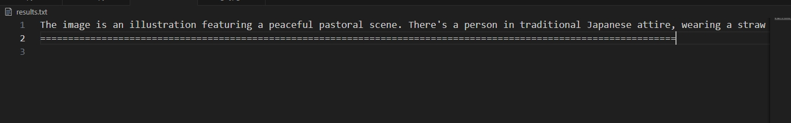

调用opanai库中的OpenAI接口实现。本文讨论的是openai-1.x以上版本，我在写这篇文章时使用的时openai-1.37。

## 1. 准备工作

在开始之前，你需要拥有一个openai平台的`api_key`，可以去淘宝或官网购买，这里推荐淘宝。

因为国内商家为了防止因代理不稳定，且确保购买的号不被封号，使用的是中转接口(卖家服务器api负责转发消息问答)。

## 2. 开始

介绍两个函数接口。

>`OpenAI(base_url, api_key)`: `chatgpt`应用`client`创建接口，我们只需要指定`base_url`和`api_key`两个参数即可。`base_url`表示的是我们上述提到的中专接口的地址，`api_key`代表的是我们购买的平台的通行证。
>`client.chat.completions.create(model, message)`: 创建对话，需要指定模型和问答小心内容。`model`仅可指定你的`api_key`允许的模型。

### 2.1 关于`message`参数

上次介绍了基础问答的`message`参数，是一个列表，包含了三个字典变量。其格式如下：

```python
message = [
    # 系统定位配置，可不配置。 “你是一个Python专家”告诉GPT它要做的事情
    {"role": "system", "content": "You are a expert in Python"}, 
    # 用户提问内容配置，“帮助我以颜色为条件筛选数据”，也就是输入的问题
    {"role": "user", "content": "help me filter the data by color"},
    # 助手配置，用来规范GPT回答的格式。“以这种格式回答： ‘筛选的数据：数据’”，可不配置
    {"role": "assistant", "content": "Answer in this format : 'data filtered : Your Filtered DATA' "}
]
```

这次的图片上传的`massage`有所不同，其格式如下：

```python
messages=[
            {
                "role": "user","content": [
                    # 第一个大括号类型定义为文本，输入你想要提问的问题
                    {
                        "type": "text", "text": "What's in this image?"
                    },
                    # 第二个大括号类型定义为图片，输入本地图片的base64编码
                    {
                        "type": "image_url",
                        # 图片格式可定义为image/png等等，编码方式为base64
                        "image_url": {"url": f"data:image/jpg;base64,{base64_image}"},
                    },
                ],
            }
        ]
```

### 2.2 返回值

使用`completion.choices[0].message`接受返回值，`completion`即为在第2节开头提到的第二个函数的接收值。

它返回一个`content`对象，里面包含了回答内容等信息。可以转换为字典来获取返回值。

```python
completion = client.chat.completions.create(
    model = 'my model', 
    message = myMessage
)

# 返回
print(completion.choice[0].message.content)
```

### 2.3 示例

```python
import os
import base64
import requests
from  openai import OpenAI

# base64编码函数
def encode_image(image_path):
    with open(image_path, "rb") as image_file:
        return base64.b64encode(image_file.read()).decode('utf-8')

# 图片目录地址
image_path = "./Imgs/"
imgs = os.listdir(image_path)
base64_image = [encode_image(image_path + i) for i in imgs]

client = OpenAI(
        base_url=Your_BASE_URL,
        api_key=Your_API_KEY)

for i in range(len(base64_image)):
    response = client.chat.completions.create(
        model="gpt-4o",
        messages=[
            {
                "role": "user",
                "content": [
                    {"type": "text", "text": "What's in this image?"},
                    {
                        "type": "image_url",
                        "image_url": {"url": f"data:image/jpg;base64,{base64_image[i]}"},
                    },
                ],
            }
        ],
    )
    with open("./results.txt", 'a', encoding='utf-8') as f:
        f.write(response.choices[0].message.content.replace("*","").replace("#","").replace(" ","") + "\n")
        f.write("===============================================================================\n")
```

示例图片为：


输出为：


