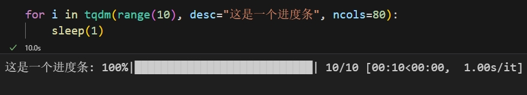
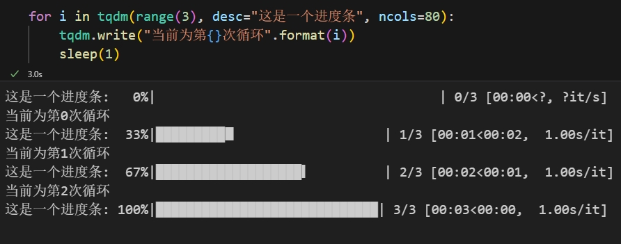

在开发过程中，尤其是深度学习或者时数据处理时，程序长时间的运行总是会让广大程序员产生怀疑、后怕、自卑、发毛的情绪。因此，在程序设计中加入进度条就显得很有必要了。

### 1. `tqdm`的安装

安装很容易，进入到工作环境直接安装，如果不分环境就全局安装即可。

```bash
pip install tqdm
```

### 2. 导入 `tqdm`

 **注意**：踩坑记录，导入并非直接导入包名，否则会报错。

```python
from tqdm import tqdm, trange
```

### 3. `tqdm`的使用

```python
from tqdm import tqdm, trange
from time import sleep
'''
参数说明：(带*号的默认不填即可)
    iterable，   需要传入的可迭代对象，作为整体进度条的尺。
    desc，       进度条的描述内容。
    ncols，      进度条的长度，可认为更改，建议更改为合适终端的长度。
    *total，     迭代次数，默认为iterable的长度。
    *leave，     布尔值，表示是否保留进度条。
    *file，      进度条保存路径，默认保留在终端即可。
    *unit，      迭代内容的迭代单位，默认为it(代)。
    *postfix，   可传入的详细数据。
    *unit_scale，单位换算尺度，默认是国际标准换算。
'''
# 使用tqdm展示进度条
for i in tqdm(range(10), desc="这是一个进度条", ncols="80"):
    sleep(1)
```

效果展示如下：

如果在循环过程中，还需要查看变量信息等，可以使用 `tqdm.write()`方法，它可以将循环中的变量进行输出。

```python
for i in tqdm(range(10), desc="这是一个进度条", ncols=80):
    tqdm.write("当前为第{}次循环".format(i))
    sleep(1)
```

效果如下：

至于 `trange`方法就是内置的封装好的 `tqdm`，即将 `tqdm`方法中的可迭代对象 `iterable`参数改为了可迭代对象的**长度**，其他基本一致。

```python
for i in trange(10, desc="这是一个进度条", ncols=80):
    sleep(1)
```

效果与上面展示的图片一致。
